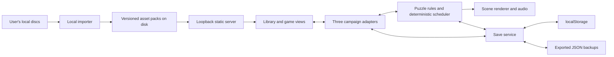

# Local Zoombinis player implementation plan

Build one local browser application that plays **Logical Journey, Mountain Rescue, and Island Odyssey**, using locally imported game data, browser `localStorage` saves, and portable JSON backups. The target is three complete campaigns plus a separate practice mode. This document is a plan; no player implementation or deployment is included in this change.

The existing research covers 28 puzzle families and 96 normal puzzle/difficulty combinations. That is a strong implementation starting point, but it does not yet establish complete campaigns, browser-ready animation, or complete independent generators. The [current specification report](../research/zoombinis/notes/puzzle-specifications.md) and [initial four-generator report](../research/zoombinis/notes/generator-parity.md) are the source of truth for individual comparison boundaries; older extraction notes describe earlier coverage.

## Product decisions

| Area | Planned behavior |
|---|---|
| Application | A separate `zoombinis-player/` package in this workspace, with its own launcher, build, tests, and storage namespace. Reuse useful save/UI patterns from the math adventure without coupling their content or save schemas. |
| Launch | One command opens a stable loopback origin, proposed `http://127.0.0.1:4188`. Refuse a busy port rather than silently changing origins. Use the same origin for normal development and packaged local runs. |
| Supported baseline | Desktop Chromium first, followed by actual Safari and Firefox verification before the all-games release. Mouse, keyboard, and touch-friendly controls. Tablet installation is a later packaging task. |
| Game data | Import the three supplied Windows disc editions into private, versioned asset packs on local disk. Install each game independently. No Internet Archive download step and no original assets embedded in the runtime build. |
| Execution | Game rules and the logical simulation run in the browser. The local server serves the application and registered asset packs. Original x86 functions remain development test oracles, not a shipped runtime dependency. |
| Persistence | Named campaign saves in `localStorage`; download/upload JSON save files for backup and transfer. Assets remain on disk. No account or cloud service. |
| Play modes | Campaign follows the original progression and consequences. Practice selects a family, difficulty, and party/input configuration without modifying campaign progress. |
| Fidelity | Preserve verified puzzle rules, information, budgets, losses, partial success, difficulty changes, and meaningful timing. Original menus need not be copied pixel for pixel. Any deliberate compatibility exception is versioned and documented. |

Serve the app over loopback HTTP rather than opening an HTML file directly: storage belongs to an origin, and `file:` storage behavior is undefined. Changing host or port requires exporting and importing saves; it must not look like the app has deleted them. [MDN localStorage](https://developer.mozilla.org/en-US/docs/Web/API/Window/localStorage)

## Player flow

The library shows the three games with installation status and a **Continue** action for the last save. Each game opens **Continue**, **New campaign**, **Practice**, and **Saves**. The play screen has the puzzle or campaign scene, relevant character/token inventory, original clues and feedback, pause, and a compact save status. Keep implementation diagnostics in a separate developer view.

The save manager lists game, save name, optional player name, location/activity, progress, current difficulty, play time, last saved time, and compatibility status. It supports:

- Continue, rename, duplicate as a new campaign branch, and create a named checkpoint.
- Export one save or all saves; import with a preview of game, version, and required asset pack.
- Import as new saves by default; replacing an existing save is an explicit operation with its recovery copy retained.
- Restore the previous valid revision, inspect/export unreadable data, and delete a selected save with confirmation.
- Display storage use and a clear saved/unsaved state. A failed write offers export of the current in-memory game and a way to free space.
- Identify missing game data without deleting or modifying the save. Reimporting the same compatible pack restores access.

Named saves are independent records. An optional player name is a grouping label, not a separate account or authentication system. A campaign save and a practice save cannot be confused or merged.

## Architecture

Use TypeScript modules, Vite for development/building, DOM controls for the shell and accessible interaction, Canvas 2D for scene composition, and browser audio for local recordings. Pin tool versions during implementation. Begin with these platform primitives; introduce a rendering library only if profiling or scene requirements justify it.



Suggested layout:

```text
zoombinis-player/
  src/app/                 library, navigation, saves, settings, practice
  src/core/                RNG, scheduler, events, snapshots, validation
  src/render/              sprites, palettes, actors, paths, audio, input
  src/storage/             commit/recovery, migrations, import/export
  src/games/logical-journey/ campaign and twelve puzzle adapters
  src/games/mountain-rescue/ campaign and nine puzzle adapters
  src/games/island-odyssey/  campaign and seven puzzle adapters
  tools/                   local launcher and asset-pack builder
  tests/                   rule, save, campaign, and browser tests
  build/                   generated runtime; no imported game content
research/zoombinis/local/player-packs/  ignored, locally generated packs
```

Give each puzzle a common interface: generate from explicit inputs, validate an action, apply the action, advance logical time, expose player-visible state, report outcomes, and serialize/restore state. Hidden rules remain available to the engine and save file but are omitted from the normal view. Campaign adapters interpret results and own progression; a puzzle cannot independently change camp inventories or award the same result twice.

Each completed encounter produces a stable result ID with exact passed/lost/remaining character IDs or ordered typed token records. Island Odyssey tokens retain stable IDs/tags and attributes, including Corral's outgoing feet/tail traits consumed by Barn; counts are summaries only. Apply the complete result and campaign transition to one new save snapshot. Resuming before that commit replays the transition; resuming after it sees the result ID already applied. This prevents duplicate rescues or production rewards and preserves token identity and order.

## Asset preparation and rendering

The first importer should be a local command built around the existing Python decoders. It accepts explicit ISO paths and writes packs to the ignored local directory; the web app reads their manifests and shows installation/progress diagnostics. Browser-only ISO import can come later without changing the pack format or save format. Proposed launcher/import commands are implementation deliverables, not commands that exist today.

A pack manifest records game and disc edition, original ISO/executable hashes, converter version, pack schema, resource IDs, content hashes, scene dependencies, authored puzzle tables, and known unsupported resources. Preserve resource IDs, offsets, anchors, palette indices, frame markers, paths, and script metadata. Pack compatibility must be separate from engine and save-schema compatibility.

Import only game-relevant content for playback; leave installers and cross-promotional material in the research corpus. Validate sizes, paths, archive bounds, and source edition. A failed conversion leaves the previous working pack intact. Unknown editions receive an unsupported-edition result rather than being interpreted with address tables from another executable.

Load the current scene and likely next scene, not all decoded frames. Generate bounded sprite atlases where useful, keep animation metadata separately, stream long audio, and release unused decoded images/audio. The current corpus is for inspection; tens of thousands of loose PNGs should not all be decoded at startup. Benchmark representative animated scenes before setting final atlas sizes and memory budgets.

The current production PNGs total roughly 125 MB on disk; decoding all of them would require about 712 MiB of RGBA memory before audio and graphics duplication. Logical Journey and Mountain Rescue alone have roughly 310 MB of main PCM audio. These measured corpus sizes justify scene loading and bounded caches; they are not final pack-size estimates.

Required art integration includes Logical Journey palette selection/transparency and character layers; Mountain Rescue ANM slot composition and PAT movement semantics; Island Odyssey indexed AO variants and frame/event metadata. Resolve every resource required by playable scenes, including the eleven currently unconverted AO files if a runtime scene references them. A static frame sequence alone does not establish timing or correct character assembly.

Island Odyssey audio also needs conversion: 286 of its 308 extracted WAV files use IMA/DVI ADPCM, and their declared sample counts disagree with complete-block totals. Audit durations and clipping against source playback before choosing a trimming/conversion policy. Decode required sound into browser-supported formats locally, retain provenance, and test cue timing. Transcode required Bink story clips locally or provide equivalent scene transitions; decorative movie fidelity can follow later. The MPS structural decoder is available, but there is no complete script VM: port verified scene/campaign behavior explicitly unless a bounded interpreter proves simpler.

The server binds to loopback, serves only the built app and registered packs, supports streaming/range requests for media, and does not expose arbitrary filesystem paths. The public build and save exports contain no original media or authored template tables. Saves contain the minimal generated instance state required to resume and are treated as private user data.

## Deterministic play and resume

Separate logical time from drawing. The scheduler uses integer time units with per-game source clock conversion, stable actor ordering, explicit event IDs, reservations, and an ordered pending-event queue. Preserve FIFO/LIFO behavior where the source differs. Apply user input at a defined tick boundary. Rendering interpolates already determined state.

Browser animation callbacks can pause in hidden tabs, so visibility changes pause the game clock and audio; returning resumes without fast-forwarding through unattended play. Muting, frame rate, and delayed audio decoding must not change puzzle outcomes. Speech completion or animation markers that affect rules must come from logical schedules derived from imported metadata, not from an unreliable media `ended` event. [MDN requestAnimationFrame](https://developer.mozilla.org/en-US/docs/Web/API/Window/requestAnimationFrame), [Page Visibility API](https://developer.mozilla.org/en-US/docs/Web/API/Page_Visibility_API)

For RNG, port the recovered arithmetic exactly, including 32-bit overflow, bounds, rejection draws, and final state. Store the materialized board, hidden parameters, current RNG state, and generation history. Do not recreate an in-progress puzzle from its seed. Initially require a declared puzzle-entry boundary rather than claiming that one seed recreates an entire original campaign. Any separation of cosmetic and gameplay randomness must be an explicit compatibility decision.

Early prototypes may resume at a clearly identified settled checkpoint. The all-games target also requires mid-motion resume for timed families: actors, path progress, deadlines, occupancy, reservations, event queue, and logical speech state must all be serializable. Resume begins paused. A last completed logical tick is the snapshot boundary; a half-applied callback is never serialized.

Autosave after accepted player actions, semantic state changes, and campaign transfers. While autonomous motion is active, coalesce saves to at most one checkpoint per second, plus pause/visibility/save-and-exit checkpoints. Save completion before showing its rewards. Do not write every render frame or rely on an unload callback as the only save. A sudden process termination may lose changes since the last successful checkpoint; the saved tick must resume exactly.

## Save contract and storage protocol

Use a namespace such as `zoombinis-player:v1:`. Every save has a UUID and two self-contained revision banks, `save:<id>:a` and `save:<id>:b`. Settings use their own small key. The save list is derived from the banks; a cached index is disposable. No operation uses `localStorage.clear()`.

| Saved field group | Required contents |
|---|---|
| Identity | Stable envelope version, save ID, active/deleted status, campaign/practice mode, game ID, label/player name, creation/update timestamps, play time, monotonic revision, commit ID, parent commit ID, and writer/session ID. |
| Compatibility | Save schema, game-state schema, puzzle-state schema, engine/ruleset revision, compatibility profile, required asset pack/edition fingerprint. |
| Campaign | Current scene/route, complete character identities and traits, camp and destination inventories, ordered typed token reservoirs with stable tags and attributes, losses/returns, achieved and selected difficulties, progression counters, rewards, tutorial/history flags, applied encounter-result IDs. |
| Active puzzle | Stable family ID, difficulty, incoming party/input tokens, full generated board and hidden rules, accepted observations, occupancy, remaining budgets, partial outcomes, generator/history inputs, current RNG state. |
| Simulation | Logical tick/time base, actors and paths, reservations, pending ordered events, logical animation/speech state, paused state. |
| Integrity | Canonically serialized payload with digest, length and strict schema validation; integrity checks detect damage and are not an authenticity/security guarantee. |

Do not save textures, audio, binaries, DOM state, cached drawing coordinates, or an unbounded action log. Keep a bounded diagnostic trace separately exportable. A save is a complete snapshot and does not depend on replaying every historic move.

**Commit protocol:** serialize/validate the candidate; acquire one short, exclusive namespace Web Lock used by every save and management mutation; read and validate both banks; compare the caller's expected revision and commit ID; write the next revision into the older valid bank or an empty bank using one `setItem`; read it back and validate; then report saved. Replacing an invalid bank requires the explicit repair flow below. The highest valid revision is authoritative. Leave the other valid bank untouched as the previous-good snapshot. If a write fails, keep the last committed revision and the current in-memory state. An ambiguous successful write followed by a read failure is reported as unverified until reread; retry that same commit ID instead of blindly allocating another revision. The guarantee is coherent replacement and recovery, not filesystem-fsync durability.

Each playing session has one commit queue with immutable snapshot sequence numbers and at most one in-flight write. Coalesce newer pending snapshots. After its own successful commit, the next queued snapshot uses that acknowledged base revision; it never silently adopts another tab's revision. Completion of an older write cannot mark newer in-memory changes as saved. If the result is uncertain, resolve that commit before advancing the queue.

This does not depend on a multi-key transaction. When a bank is missing or corrupt, offer the other and retain the damaged bytes for inspection/export. Equal revisions with different commit IDs/payloads are a conflict requiring explicit recovery. Distinguish damage from a newer unsupported schema: preserve the newer revision and block rewriting it, rather than silently falling back to and overwriting it from an older one. If neither bank validates, quarantine that save and continue showing other saves. A corrupt save must not invalidate the entire collection. Browser storage itself is not a substitute for exported backups. The storage standard provides no cross-tab read/modify/write lock. [WHATWG Web Storage](https://html.spec.whatwg.org/multipage/webstorage.html)

Quarantined saves do not receive automatic writes. Recovery defaults to copying the usable snapshot into a new slot, leaving the damaged original available to export. An explicit repair operation may replace an invalid bank after offering raw export. A merely missing bank can be recreated normally. This keeps routine autosaves from destroying the evidence promised by recovery.

Use short Web Locks for coordinated commits; avoid holding a namespace lock for a whole play session. Broadcast active sessions so a second tab normally opens the same save read-only and can request a cooperative pause/flush/handoff. Those notifications are only UI hints: correctness comes from the lock and expected commit ID/revision check. Two simultaneous openings can race; the stale writer must pause with its in-memory game intact and offer reload or duplication. It never adopts an incoming revision into dirty memory or force-steals a lock based on a timeout. Revalidate after lifecycle suspension. If Web Locks are unavailable, disable shared-save mutation and offer an explicitly separate temporary session/export rather than claiming race-free writes. [MDN Web Locks](https://developer.mozilla.org/en-US/docs/Web/API/Web_Locks_API)

LocalStorage's documented limit is approximately 5 MiB per origin. Start with a conservative 3 MiB application budget, counting both banks, keys, and settings; estimate UTF-16 storage size and treat actual write results as authoritative. Target small snapshots and measure the largest late-game campaign before setting a hard per-save cap. Save capacity depends on actual serialized size, not an untested promise of a fixed number of slots. Keep replacement headroom; never discard a valid recovery bank automatically just to squeeze in an update. [MDN storage quotas](https://developer.mozilla.org/en-US/docs/Web/API/Storage_API/Storage_quotas_and_eviction_criteria)

Export one portable JSON file or a versioned bundle of saves, including compatibility metadata but no game assets. Validate file size, nesting/collection bounds, field types, IDs, and semantic state before any write. Import strips unknown fields and creates new IDs by default. One save commits independently; a multi-save import previews capacity and reports which records committed if storage runs out. Do not promise all-or-nothing atomicity for a batch spanning keys.

Deletion first commits a higher-revision tombstone through the same protocol. While retaining the namespace lock, remove the older payload bank, and only after that succeeds remove the tombstone bank. An interruption must not revive an old save. A committed tombstone means logically deleted; a later removal failure reports **Deleted; local cleanup incomplete**. Deferred cleanup reacquires the lock and verifies the same tombstone before removing anything. A failed tombstone commit leaves the save active. Stale autosaves reject missing/deleted slots and cannot recreate them implicitly; explicit new-save/import operations allocate fresh IDs. Restoring a previous snapshot is a new forward revision, not a rollback of the revision counter.

Migrations are explicit and tested against fixtures. Preserve the old snapshot until the new one commits. Unknown future schemas are viewable/exportable but cannot be loaded or rewritten by an older runtime. A ruleset update must either migrate the active board or retain the old ruleset adapter; it cannot regenerate a different puzzle silently. After import/migration, resume paused and validate required assets before advancing time.

## Three campaign adapters

| Game | Work beyond individual puzzles |
|---|---|
| Logical Journey | Persistent recruitment and names, trait-tuple recruitment limits, 16-member departures, two camp inventories, route choices, return of unsuccessful characters, trail/difficulty counters, destination population and rewards. Preserve partial-party behavior and cross-puzzle histories. |
| Mountain Rescue | Distinguish initial 16-member recruitment from eight-member camp departures; recover picker constraints, rescue pools, route transitions, failed-member returns, per-activity counters, Booliewood population, and the 400-Boolie finale. |
| Island Odyssey | Typed inventories and conversions among caterpillars, chrysalises, moths, plants, berries, and Zerbles; commit partial output when leaving; preserve leftovers; map access thresholds, selected/achieved difficulty, history, and biome progression. Greenhouse and Corral have a twelve-token entry threshold that differs from the usual one-token threshold. |

Recover and test campaign transitions before treating these summaries as an executable specification. Sources include the extracted manuals (Logical Journey pages 9–15, 19, 28, 33; Mountain Rescue pages 9–14, 24; Island Odyssey pages 9–15, 29), family native progression blocks, and Island Odyssey MPS/XML evidence. Native behavior takes precedence over broad manual wording where they differ: for example, the recovered Bubble Bumpers counter does not reset after a partial crossing, so a generic “three consecutive successes” implementation would be wrong.

## Research that blocks complete playability

| Dependency | Required resolution | Completion evidence |
|---|---|---|
| Pizza Pass | Recover full troll/offer selection, feedback routing, legal offers, limits, and completion. | Differential encounter traces, including rejected offers, troll order, exhaustion, partial/full outcomes. |
| Greenhouse | Recover path annotations, moving moth/beetle decisions, occupancy, and operational success. | Event traces and playable witnesses; reversing the generator scramble alone is insufficient. |
| Stone Rise, Bubblewonder, Bubble Bumpers L1 | Replace remaining native generator calls with browser-executable independent implementations. | Same inputs, boards, rejected draws and RNG exits as the guarded original-function oracles. |
| Toads, Bubblewonder, Catapult, Snowboard | Produce the frame/event observations currently supplied by harnesses; integrate reservations, clock rules, speech, collisions and ordered callbacks. | Native event comparisons plus end-to-end deterministic scene traces and save/resume equivalence. |
| Bubble Bumpers memory-sensitive paths | Define explicit deterministic initialization for undefined scratch/heap state, and a bounded policy for source paths that read outside the logical party or fail to terminate. | Compatibility profile, fixtures showing differences, and tests on every reachable campaign party size. Never silently reroll a saved board or describe normalized memory behavior as full original-session parity. |
| Shared campaigns | Recover transfer, recruitment, loss/return, history, difficulty and ending state across all scenes. | Complete route/production-chain tests with conservation checks and idempotent result commits. |
| Runtime assets | Resolve required palettes, layers, markers, anchors, path semantics and scene bindings. | Original-resource visual checks and interaction/event comparisons for each family. |

For undefined/nonterminating source cases, the deterministic compatibility policy is a release decision backed by fixtures, not an excuse to hang the browser. Implement bounds and diagnostics early; the affected family remains development-only until a usable policy is specified and tested. Original save-file interoperability, full-session random-stream parity, decorative cutscene fidelity, and exact lip sync are later parity work. They do not replace the required gameplay and campaign work above.

## Implementation sequence and subagent batches

Keep one integrator responsible for shared contracts, scheduler, saves, asset-pack schema, and cross-game checks. Delegate the three game adapters independently once those interfaces are fixed. Give each batch exclusive module ownership and require a rule trace, playable witness, serialization fixture, and browser result before integration.

| Milestone | Deliverables | Exit condition |
|---|---|---|
| 0 — Foundations and risk discovery | Separate package, launcher/pack manifest, save schema, campaign-state audit; early spikes for Catapult timing, Greenhouse movement, character assembly, and native-only generators. | Three editions identified, largest risks have concrete traces or bounded findings, storage failure/recovery prototype passes. No assumption that the remaining work is routine UI wiring. |
| 1 — First playable slice in each game | Hotel Dimensia, Turtle Hurdle, Garden; minimal scene renderer, generator/action adapters, named saves and backup UI. Ferryboat may precede Hotel as a small renderer/placement exercise. | Play and reload the same board at every normal difficulty; export/import into a clean browser; partial/full result preserved. |
| 2 — Complete the foundation batch | Remaining static/deduction families listed below, source art/feedback bindings, browser differential harness; campaign inventory/map skeletons developed in parallel. | Fifteen total families playable with all normal levels and serialized outcomes. Campaign skeletons cannot bypass missing encounters and count as completed games. |
| 3 — Complete stateful families | Seven additional families, campaign transitions, recruitment/production inventories, history and difficulty progression. | Twenty-two families playable; transfer, return, budget exhaustion, and save migration tests pass. |
| 4 — Complete moving families | Six remaining families, source-derived timing, independent generators, mid-motion snapshots and remaining required art conversion. | All 28 families/96 normal difficulty combinations usable; timed reload traces equal uninterrupted traces. |
| 5 — Three complete games | Full campaign routes and endings, sound/feedback polish, bounded memory use, desktop browser matrix, local release packaging. | All release criteria below pass without original-code runtime calls or unimplemented scene bypasses. |

Full family assignment (each family appears exactly once):

| Batch | Logical Journey | Mountain Rescue | Island Odyssey |
|---|---|---|---|
| First slices | Hotel Dimensia | Turtle Hurdle | Garden |
| Foundation | Allergic Cliffs; Stone Cold Caves; Captain Cajun's Ferryboat; Mudball Wall; Lion's Lair; Mirror Machine | Pipes of Paloo; Magic Mirrors; Chez Norf; Beetle Bug Alley | Wall; Barn |
| Stateful | Fleens; Stone Rise; Pizza Pass | Aqua Cube; Boolie Boggle | Planetarium; Corral |
| Moving | Titanic Tattooed Toads; Bubblewonder Abyss | Snowboard Gulch; Bubble Bumpers | Catapult; Greenhouse |

These are integration batches, not a reason to postpone difficult research. Timed-engine and missing-generator work begins in milestone 0 and continues alongside the first playable slices. Reestimate after those spikes and after the first three scenes; a calendar commitment before that evidence would hide the largest uncertainty.

## Verification and release criteria

Use the Python models, original-function oracles and saved fixtures for development comparisons, then export local fixtures for TypeScript tests. Rule tests compare generated state, feedback, budgets, random consumption and outcomes, including documented source quirks. Browser tests exercise actual controls. No test should depend on an original executable being present in the runtime package.

Required checks:

1. **Coverage:** all 28 family IDs and all 96 normal difficulty combinations dispatch to implemented rules and views. Diagnostic fourth-level Mountain Rescue branches are not normal selectable levels.
2. **Campaigns:** complete both route alternatives where present, representative partial/failure/return paths, level advancement, and each ending; verify character/token identity, attributes, order, conservation, and no duplicate result awards. Test Corral→Barn transfer with reload on both sides of the commit. Practice cannot alter a campaign.
3. **Saves:** compare uninterrupted and resumed state, next RNG draws, next legal actions, feedback and outcomes. Include mid-motion save points, pending dialogue/markers, actor reservations, last-costly-move rescue, and transition before/after reward commit.
4. **Storage failure:** missing/corrupt banks, two conflicting revisions, blocked storage, failed writes/readback, near-quota replacement, interrupted import/delete/migration, unsupported future version, and an unrelated corrupt save. Delay serialization/writes while more actions occur; verify the commit queue and saved indicator. Inject failure after each deletion step and race deferred cleanup with restore/import replacement. Preserve existing valid saves; never claim persistence after failure.
5. **Management:** create, rename, duplicate, restore, export one/all, preview/import, delete, change browsers through export/import, reinstall assets, and reopen with a missing/mismatched pack.
6. **Concurrency:** two tabs on the same save, two different saves, storage events during dirty play, lifecycle suspension, and controlled handoff. Stale revisions must never overwrite newer ones.
7. **Presentation:** traits remain distinguishable, scene geometry matches action rules, clues are legible, keyboard/touch controls work, audio unlock/mute does not alter logic, and hidden/background tabs pause consistently.
8. **Local operation:** fresh install from supplied media, then play with the Internet disconnected while the loopback server runs. No runtime CDN, remote font, analytics, or remote asset request. Inspect the release directory to ensure imported media and research binaries are absent.
9. **Performance:** measure scene load, decoded image/audio memory, scheduler latency, and save serialization/commit pauses on the target machine. Stress the largest late-game save and long animated scenes; cap caches and diagnostic logs.

Ship when three campaigns can be started, played through, interrupted, restored, and completed using the locally installed packs and browser runtime. A library displaying three cover images, a set of practice boards, or a renderer calling the research backend does not satisfy that gate.

## First implementation task

Implement milestone 0 and the shared shell/save foundation, then deliver Hotel Dimensia, Turtle Hurdle, and Garden as the first three vertical slices. In parallel, assign the three campaign audits and the timed/native-generator risks to bounded subagent tasks. Keep the existing math adventure running independently throughout.
